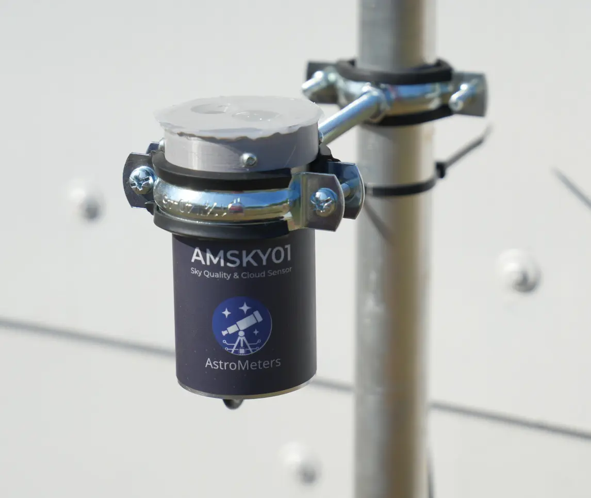
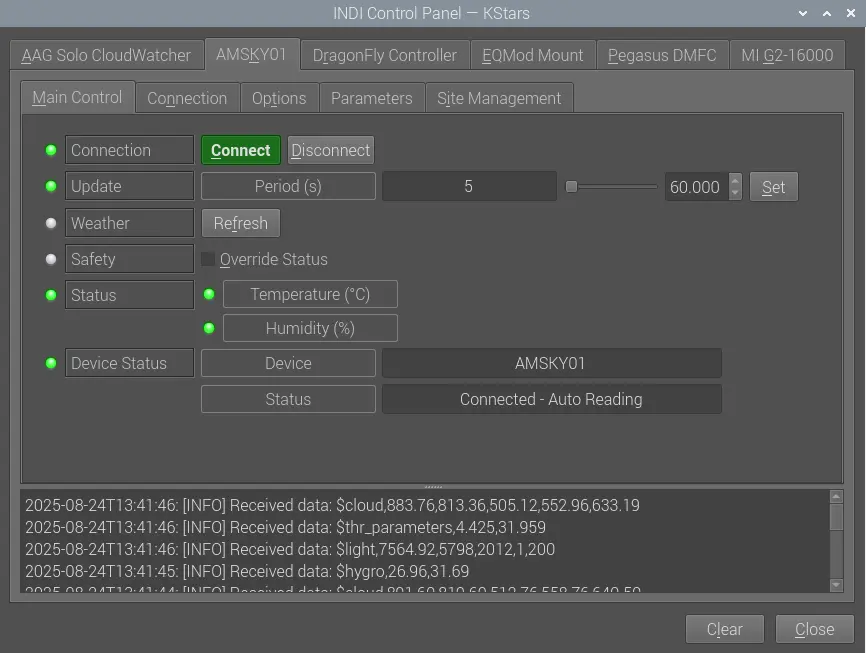
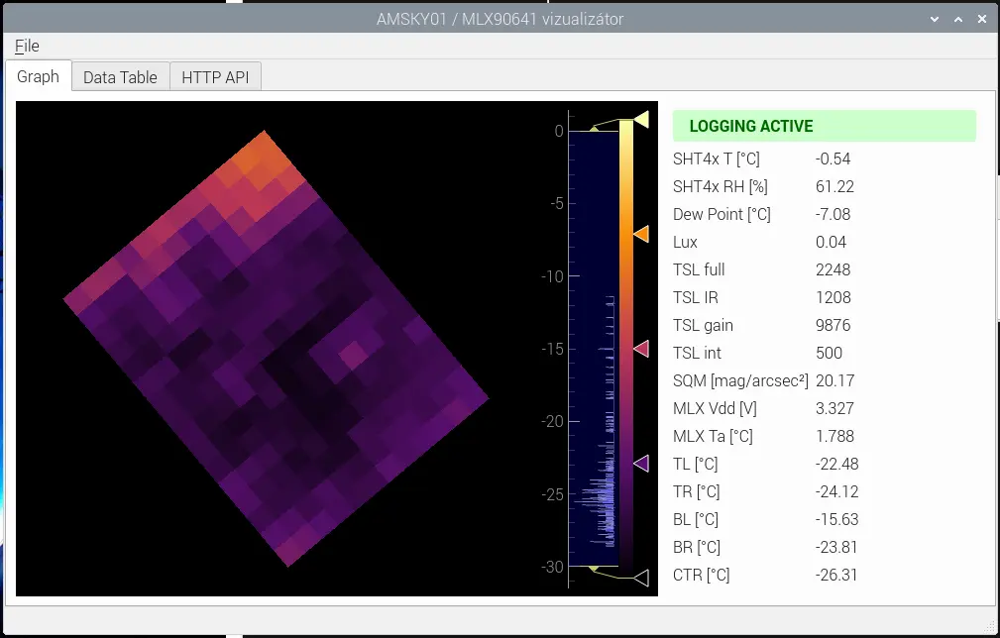

## Overview

The **[AMSKY01](https://astrometers.eu/products/AMSKY01/)** is a compact, weatherproof sky sensor designed for astronomical observatories and environmental monitoring. It combines sky brightness measurement, infrared cloud detection and ambient condition monitoring in a single outdoor-rated unit.



> **Note:** AMSKY01 is the first generation of the AstroMeters sky sensor family. Its successor, [AMSKY02](https://astrometers.eu/products/AMSKY02/), provides dual SQM sensors and a higher-resolution dual thermopile array. Both models use the same `indi_amsky01` driver and communication protocol.

## Features

- **Sky brightness (SQM)** – TSL2591-based measurement in lux and mag/arcsec²; 10° or 60° field of view (selectable).
- **Infrared cloud sensor** – MLX90641 16×12 pixel thermopile array with 75°×110° field of view for sky temperature mapping.
- **Temperature & humidity** – SHT4x sensor for precise ambient condition monitoring including dew point calculation.
- **USB-C and RS-485 interfaces** – plug-and-play serial connection or industrial RS-485 bus.
- **IP53W weatherproof enclosure** – designed for continuous outdoor use in observatory conditions.

## INDI Driver

The driver `indi_amsky01` provides the following INDI interfaces:

- **Weather** – sky quality (SQM), cloud status, temperature, humidity, dew point.
- **Auxiliary** – raw sensor readings and IR frame data.

### Starting the driver

```bash
indiserver indi_amsky01
```

### Connection

In KStars/Ekos, select the **AstroMeters AMSKY01** driver. You can connect via:

- **Serial** – direct USB-C connection (`/dev/ttyACM0` or by-id symlink).
- **TCP** – if the device is shared over the network via `ser2net`.

#### Stable device naming (udev)

```udev
SUBSYSTEM=="tty", ATTRS{idVendor}=="1209", ATTRS{idProduct}=="ae02", SYMLINK+="ttyAMSKY"
```

Apply with:
```bash
sudo udevadm control --reload-rules && sudo udevadm trigger
```



## Python Viewer

A GUI visualiser (`amsky01_viewer.py`) is available for real-time data display including IR thermal map, SQM readings and environmental data.

```bash
python3 amsky01_viewer.py --port /dev/ttyACM0 --baud 115200
```



## Technical Specifications

| Parameter | [AMSKY01](https://astrometers.eu/products/AMSKY02/) |
|---|---|
| Cloud detection | MLX90641 16×12 px, 75°×110° FoV |
| Sky brightness (SQM) | TSL2591, 10° or 60° FoV, mag/arcsec² |
| Temperature range | −15 °C to +50 °C |
| Humidity | SHT4x relative humidity |
| Interfaces | USB-C (CDC serial), RS-485 |
| Power supply | USB bus power or external 8–13 V DC |
| Ingress protection | IP53W |

## Resources

- [AstroMeters documentation](https://astrometers.eu/docs/AMSKY/)
- [Product page](https://astrometers.eu/products/AMSKY02/)
- [AMSKY02 driver documentation](/weather-stations/astrometers/amsky02/amsky02)
